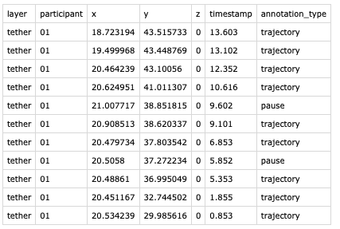

# Tether

## Description
TETHER enables the connection of a video playback in Processing and a CAD drawing in Rhinoceros. Behind the scenes, the Processing script relies on the OSC protocol to broadcast the playback position (i.e. the timestamp of the current frame, expressed as milliseconds from start, and as a percentage of the total movie duration). On the Rhinoceros side, a Grasshopper script, receive the timestamp information and allows the user to control the movie playback. When the user adds a new point on the current drawing on Rhino, the timestamp gets appended to the point as the object name as well as a separate attribute.  

## Why would I want to use Tether?
Tether allows you to manually create trajectories or trace other behaviours in a spatial format that includes timestamps obtained from a video source.

The data are then saved as a Rhino file (.3dm) as points with xyz coordinate and additional attributes (ID, timestamp, behaviour type). Tether helps to then export this point data into a csv file for further processing, e.g. in QGIS or R.

## Why does it rely on Rhinoceros, rather than a QGIS or another FOSS solution?
The aim was to create a tool that supports a wide range of cases and behavioural experiments. The tool was specifically motivated for our experiments inside real buildings, where people walk across multiple floors. Rhino works natively with various floorplans, and is made to support a user to enter or inspect their data in a 3D mode. QGIS can do 2.5D, but 3D is less flexible especially when you are creating the data. If you have other suggestions of how this could be implemented, don't hesitate to raise an issue or send an email.  

## How do I get started? 
1. Download this repository
2. Read the documentation and tutorial [here](https://pmavros.github.io/Tether/)

## Roadmap
- improve backwords compatibility with Rhino 7 (need to change some components for python in GH)
- convert into a Rhino Plugin instead of GH script.
- Implement a version compatible with FOSS sofware such as QGIS (although that is not suitable for modelling 3D environments/behaviours.

We are looking for contributors!
