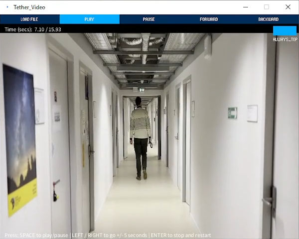

## Getting started!
* TOC
{:toc}

### Description

TETHER enables the connection of a video playback in Processing and a CAD drawing in Rhinoceros. Behind the scenes, the Processing script relies on the OSC protocol to broadcast the playback position (i.e. the timestamp of the current frame, expressed as milliseconds from start, and as a percentage of the total movie duration). On the Rhinoceros side, a Grasshopper script, receive the timestamp information and allows the user to control the movie playback. When the user adds a new point on the current drawing on Rhino, the timestamp gets appended to the point as the object name as well as a separate attribute.  

### Why would I want to use Tether?
Tether allows you to manually create trajectories or trace other behaviours in a spatial format that includes timestamps obtained from a video source. The data are then saved as a Rhino file (.3dm) as points with xyz coordinate and additional attributes (ID, timestamp, behaviour type). Tether helps to then export this point data into a csv file for further processing, e.g. in QGIS or R.

## Tutorial - how to use

TETHER consists of two independent parts that you need to get running (read below if you want more on the system architecture):
1. A video player
2. An annotation plugin running within the 3D modelling sofware Rhinoceros
   
### Download / Install
#### To run the annotation tool in Rhino
1. If you don't have it installed already, download and install [Rhinoceros 3D](https://www.rhino3d.com/) **version 8** for Windows (license or use up to 90 days on trial version). At the moment the tool does not work on Rhino for Mac or earlier versions of Rhino. 
2. Download the latest release of Tether or get the whole repository as a zip file. Unpack zip.
3. Start Rhino, start Grasshopper (enter command grasshopper). From Grasshopper > Open File > [... folder where you saved the Tether]/tether.gh
4. Rhino will then prompt you to install the dependencies of Tether using its own package manager. This typically covers some of them, but you need to install the rest manually.
5. Go to the Grasshopper Window, File > Special Folders > Components Folder. Then drag-and-drop the following files: _Human.gha, TreeFrog.gha, gHowl_r50.gha_ 'Tether/Tether_Grasshopper/dependencies' to the 'Components Folder'
6. Restart Rhino.

#### To run the Tether Video
1. Open the file _Tether_video.exe_ that you can find inside the download Tether folder / Tether_video/Windows/.

You may need to install JAVA SE/SDK oracle.com/java/technologies/downloads/#jdk23-windows. Alternatively, download Processing [https://processing.org/download](https://processing.org/download) and run the file _Tether_video.pde_ instead. Either solution works the same.

### Annotate

1. In Rhino, open the file where you want to add the spatial annotations (e.g. a floorplan).
2. Create a new layer called _tether_. (Make sure it is lowercase (NOT Tether).
3. In Rhino, start Grasshopper, and open the file Tether_<version>.gh
4. Start the Tether_video.exe (or .pde, see instructions above)
5. While the video is playing, add new point geometries.
6. When you finishing annotating one or more video clips, go to the export panel and select the layer you want to export (it will only work to export point data).

### Best practices:
7. When you finish one set of annotations, e.g. finish data from one participant, or one task, move all the points to a different layer (e.g. data, or data_participant_XX) so that the _tether_ layer only has the data you are working on.

### Troubleshooting

> I made a mistake, I need to add more points in a trajectory.
> 
No problem, playback the video where you want to add more points/behaviour and add them. Tether always listens to the timestamp of the frame displayed, so it does not matter in what order you added the annotations...

>I have Tether open in Grasshopper, but the timestamp is not updating.
>
You might have multiple instances of the tether.gh file open, and only one can receive the timestamps. Close the other .gh or restart Rhino.

## System Architecture
TETHER consists of two independent parts:

### #1 A custom video player made with Processing http://processing.org

A lightweigh processing script:
1. plays a movie file using the VLCJVideo library (so it should play most files).
2. **broadcasts the timestamp** to the localhost using the OSC protocol. 
3. Receives playback commands from the keyboard and also from Rhino/Grasshopper (see next) again using OSC.

The following external libraries are used. You can directly install both libraries from Processing (Tools > Add Tool > ...)

1. Andreas Schlegel 's OscP5 and NetP5 libraries - http://www.sojamo.de/libraries/oscP5/. This allows us to send / receive messages with other applications using the [OSC protocol](http://opensoundcontrol.org/introduction-osc)
1. Oleg Sidorov 's VLCJVideo library - https://github.com/icanhazbroccoli/VLCJVideo

### #2 Rhinoceros 3D modeling software https://www.rhino3d.com/

A Grasshopper (GH) Script does four things:

1. It creates a simple UI to control the type of input and movie playback.
1. It listens to the localhost for incoming OSC messages, and receives the timestamp of the current frame using (sent by Processing).
1. It sends OSC messages with playback commands ( go +/- 5 seconds, use a slider to move in the movie).
1. It listens to the Rhino runtime environment for the addition of new *point* objects. When a new point is detected, the information from the timestamp, as well as other information determined by the user are appended.

The GH script relies on the following dependencies (external plugins that need to be loaded) and credit goes to their authors:
1. Human UI - [https://www.food4rhino.com/en/app/human-ui](https://www.food4rhino.com/en/app/human-ui)
1. gHowln - [https://www.food4rhino.com/en/app/ghowl](https://www.food4rhino.com/en/app/ghowl)
1. Heteroptera - [https://www.food4rhino.com/en/app/heteroptera](https://www.food4rhino.com/en/app/heteroptera)
1. Lunchbox - [food4rhino.com/en/app/lunchbox](food4rhino.com/en/app/lunchbox)
