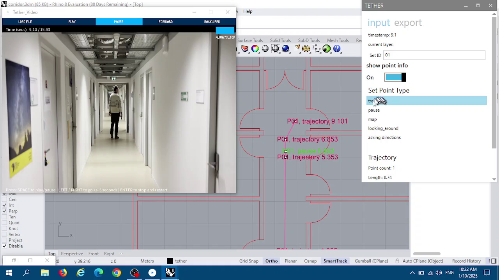
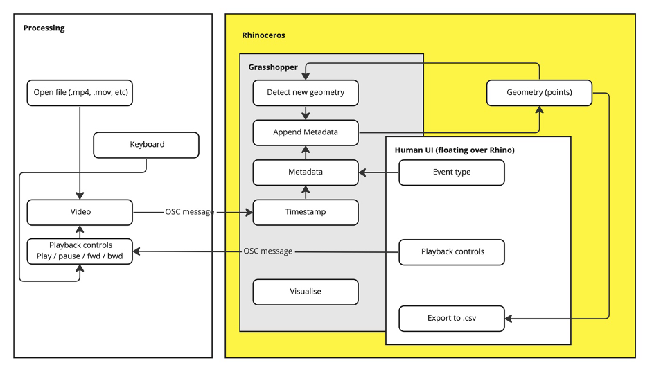

# Summary

There is a growing interest in the study of human behaviour that unfolds in space and time, for instance the analysis of pedestrian navigation, wayfinding in indoor environments like hospitals or shopping malls, and others. Architectural cognition research, as this field is formally known [@montello2014spatial,@dalton2018architectural] can greatly improve our understand of of how people perceive, reason and experience their surroundings. Typically, the concurrent recording of 4-dimensional data, i.e. coordinates and timestamps (x,y,z,t) of such phenomena is performed using a Global Navigation Satellite System (GNSS). However there numerous cases, where such data sources are not available, for instance recording gestures without the use of inertial technology [@brosamle2018approaching], in indoor or underground spaces where conventional navigation technology cannot be deployed easily and accurately [@mavros2022human], or simply when signal quality is suboptimal, e.g. due to satellile signal degradation near tall buildings. Simply put, while a runner can record their movement patterns using GNSS data, for a person navigating inside a complex building this is not as practical (technical solutions exist but are not always available to researchers and laypersons). 

Here we address this issue with 'Tether', proposing an intuitive interface between a video playback and a computer-aided design (CAD) software to create and manipulate spatial data with time stamps and other annotations \autoref{fig:screenshot}. In contrast to other existing software software, Tether adopts an offline approach with common digital video cameras (as independent devices or integrated in smartphones etc) to record a behaviour or phenomenon as video and, in an offline processing step to convert the video into not only 4D, but 5D information (3D coordinates, timestamps and behavioural annotations).

# Statement of need

Various domains of study of human behaviour in space and time requires ways to record events in both spatial and temporal coordinates. For example, the study of how a person navigates between two locations in a city, or the study of attention allocation using eye-tracking both involve a behaviour (navigation or gaze respectively) that is taking place in a unique location and changes over time. While for many cases there exist frameworks to obtain spatiotemporal coordinates of behaviour in real-time(e.g. eye-tracking), there is a need for a tool that supports the post-hoc ‘spatial annotation’ of behaviours. One such example is that study of human navigation in complex multi-floor buildings. Because of limitations of current positioning technologies , it is not possible to obtain accurate and precise coordinates of behaviour. Lack of precise and/or timestamp spatial behaviour, makes more complex also the analysis of other phenomena, or the combination of spatial data with psychophysiological and other temporal data such as eye-tracking, skin-conductance, EEG and others. This challenge is relevant for researchers in spatial cognition, wayfinding, evacuation studies, gesture analysis where behaviour is both spatially and temporally sensitive, and yet there is no readily available tool to extract movement patterns/trajectories from other means such as intertial sensors or indoor positioning technologies.

For other types of data, for example analysis of conversation exchanges from audio or video, there are both free-open-source (e.g. [ELAN](https://archive.mpi.nl/tla/elan), [Taguette](https://www.taguette.org) and proprietary (e.g. NVIVO, MaxQDA, etc.) tools to transcribe and code behaviours while preserving the temporal information (typically timestamps). For spatial behaviours, while the outcome is conceptually similar, there is lack of similar software [@brosamle2018approaching]. In some cases, people annotate behaviour by discarding temporal precision (e.g. drawing a polyline to represent a trajectory of movement without any timestamps). One notable previous solutions was “PeopleWatcher” [@dalton2015people] which allowed to timestamp spatial behaviour in a dedicated iPad interface. Beyond issues of maintenance and continuity (application can no longer be used in new iPads), it was limited by two factors: firstly it had to be operated ‘online’, i.e. during the experiment, putting high attentional demands to researchers and limiting the amount of detail possible to enter, second it operated on the basis of 2D images of floorplans, rather than a 3D coordinate system which might limit some time of behaviours. The software described here, named 'Tether' addresses this gap by proposing a interface between an (enhanced) video-player and a CAD software, capable of flexible and extensible processing of spatial behaviours and phenomena.

## Use cases

'Tether' was designed with an open-ended logic. Users can load different types of behavioural recordings (video and/or audio), and can also define custom annotations, or develop extensions in terms of data input and output. \autoref{fig:screenshot} illustrates a potential use-case, the spatial annotation of behavioural data recorded on video. For example, a researcher studying human wayfinding has video footage of a participant who performs various navigation tasks (i.e. walking between locations) inside a large building with multiple floors. She can use Tether to create a spatiotemporal annotation of the participant’s trajectory. The video playback provides spatial and temporal information, i.e. where the participant is at any given time during the experiment. She can also use Tether to playback the video, and use the Tether-Grasshopper module to create timestamped points, of the trajectory, as well as other behavioural annotations of events and actions (e.g. where the participant made a pause etc). Similar use-cases can be implemented for other types of behaviour where the spatial component needs to be recorded. We have used 'tether' to create timestamp trajectories in an underground public transport hub (metro) and perform data-fusion with eye-tracking data. Another use-case could be the annotation of video data, e.g. a video walkthrough, in terms of the physical environment. For example, an urban design researcher can record a video walking through a street or district, and then create timestamped annotations on a map of this area, in terms of urban design elements (e.g. presence of trees, shops, other facilities). Potential extensions can be considered that help annotate the type of facades along a building. Due to the flexibility of the underlying Rhino software,'Tether' could also be extended with the addition of any 3D data from intertial sensors.

# Design

'Tether' consists of two separate modules\autoref{fig:example}, a video-player and an annotation tool inside a computer aided design (CAD) software, which are developed in Processing.org (Unity) and Rhinoceros/Grasshopper environments respectively. Each environment handles a different task as described below. 

The video module was developed in Processing.org and relies on the popular VideoLAN library to handle the video and audio playback in a wide variety of formats. This module enables the user to load file from disk, and then play backwards/forwards (like a regular video player), as well as in 5-second increments using the arrrow-keys. More importantly, 'tether-video' communicates with other software using the flexible OSC protocol, to a) broadcast the timestamp of each displayed frame and b) receive input controlling playback from an external application. 

In parallel, the 'Tether-spatial' module was developed in the Grasshopper scripting environment of the McNeel Rhinoceros 3D (or just Rhino, a popular computer-aided architectural design software). Rhino was chosen for its flexibility to handle 2D, 3D and GIS information, and the possibility to write customisable scripts in its Grasshopper environment. It consists of 3 submodules: 
1. The first receives OSC messages from 'Tether-video', which contain the timestamp of the displayed frame, and also sends OSC messages to 'Tether-video', in order to control playback (e.g. go forward 5 seconds). 
1. The second module listens for any new, point-type, geometry added in the Rhino environment by the user, and adds metadata to it: specifically the timestamp information and the type of behaviour pre-selected by the user. 
3. The third module provides a UI to monitor and control the playback, as well as to allow the user to switch between predefined types of behavioural annotations (e.g. trajectory, pause, etc). 
4. The fourth module controls the visualisation of the behavioural annotations on screen.
5. The fifth module exports the layer with the annotations as '.csv' file, consisting of spatial coordinates (x,y,z), timestamps (t), behavioural annotations, and participant information.

This open-architecture allows possible extensions, such as different programs to send information to Rhino/Grasshopper environment, or integrating other software for annotations and data recording in more common GIS tools (e.g. QGIS). 

# Future developments

The development of Tether is based on the technical goals described above, namely to connect spatiotemporal and behavioural data for offline processing. Future work can look to integrate more types of spatial data and tools supported (e.g. QGIS), as well as other analytical modules for the processing of spatial annotations of behavioural and other data.

# Availability

The tool is available on GitHub and the documentation and tutorials are available to guide new users.

# Acknowledgements

The development of Tether begun at the Future Cities Laboratory (FCL) in Singapore and continues at Télécom Paris. 

# References